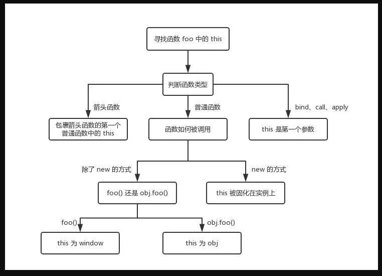

# this的指向
简单来说this指向**最后一次**调用他的环境


```js
function foo() {
  console.log(this)
}
```

直接调用foo() 指向window

obj.foo() 指向obj（上下文）

let a = new foo() 指向a

## 箭头函数中的this
```js
function a() {
  return () => {
    return () => {
      console.log(this)
    }
  }
}
console.log(a()()())
```
取决于包裹箭头函数的第一个普通函数的this指向 此处为a window 

bind等对箭头函数无效

```js
let a = {}
let fn = function () { console.log(this) }
fn.bind().bind(a)() // => ?
```
bind无论几次 均取第一次的结果

