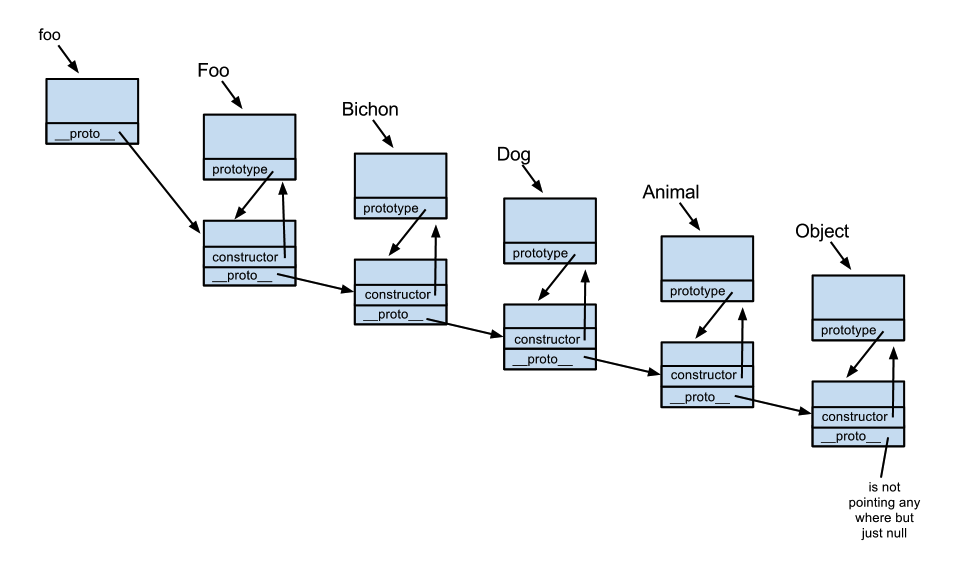

# 原型链

## 理解
js在设计的时候使用了new和构造函数的方式来生成实例，但是这种方式有个缺点：**无法共享属性和方法**

1. 每次new后生成的实例都是独立的，修改其中一个，不会影响另外一个，无法做到数据共享

2. 每次生成实例都会有许多相同的属性和方法占用内存，这是极大的浪费

所以引入了**prototype**属性

## prototype
这个属性包含一个对象，所有实例需要共享的属性和方法都放在这个对象里面，而不需要共享的，就放在构造函数里面

实例对象一旦创建，将自动引用**prototype**对象的属性和方法。

也就是说，实例对象的属性和方法分两种，一种是本地的，一种是引用的

这时所有实例相同的属性和方法都是同一个内存地址，指向**prototype**对象，这样就提高了运行效率

## 验证方法
1. isPrototypeOf

某个prototype对象和实例之间的关系

```js
Cat.prototype.isPrototypeOf(cat1) //true
```

2. hasOwnProperty

每个实例对象都有这个属性 用于判断某个属性到底是本地的还是引用的

```js
function Cat() {
  this.name = 1
}
Cat.prototype.aaa = 2
let cat1 = new Cat()

cat1.hasOwnProperty("name") //true
cat1.hasOwnProperty("aaa") //false
```

3. in

用于判断实例是否含有属性，不管是引用的还是本地的
```js
"name" in cat1 //true
"aaa" in cat1 //true
```

## 总结
1. 构造函数会有一个**prototype**属性，实例会有一个__proto__属性 他们均指向原型对象

2. 原型对象的__proto__属性指向更上一级的原型对象

3. 原型对象的constructor属性指向构造函数

4. 所有的实例通过原型链都指向Object的原型对象 最终指向null



so
```js
Object.__proto__ === Function.prototype
Function.prototype.__proto__ === Object.prototype
Object.prototype.__proto__ === null
```