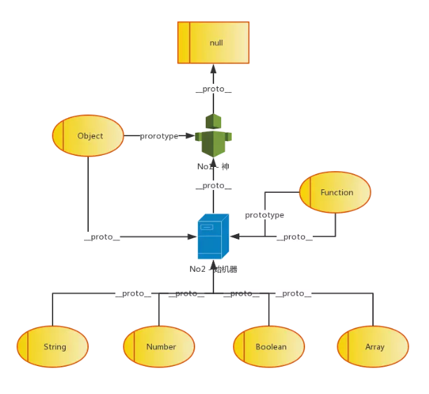

# 原型链


1. 所有对象的__proto__都执行No2
2. Function的prototype同样指向No2
3. Object的prototype指向No1

so
```js
Object.__proto__ === Function.prototype
Function.prototype.__proto__ === Object.prototype
Object.prototype.__proto__ === null
```