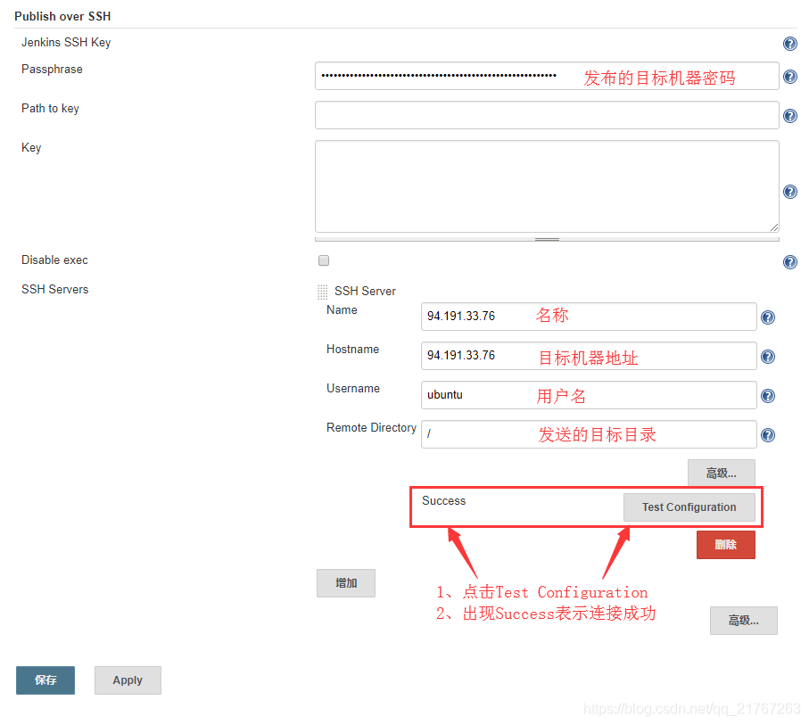
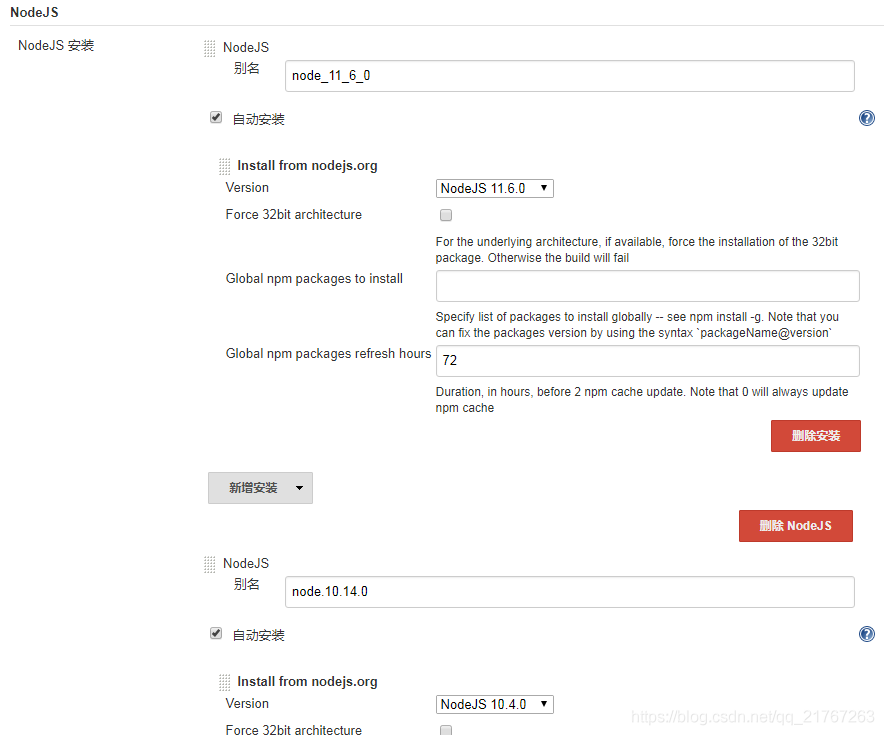
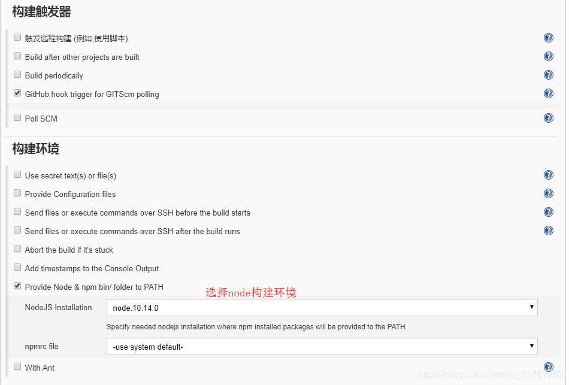

# jenkins实现自动化构建

## 安装

1. 安装docker
2. 安装jenkins镜像 使用最新版本 jenkins/jenkins:lts
3. 新建文件夹并设置权限

    ```bash
    mkdir /var/jenkins_home
    chmod -R 777 /var/jenkins_home
    ```

4. 启动容器

    ```bash
    docker run -d -p 49002:8080 --name web_jenkins -v /var/jenkins_home:/var/jenkins_home jenkins/jenkins:lts
    ```

5. 初始化 访问<http://IP:49002> 按照指引继续

6. 安装插件

## 插件

* Publish Over SSH
* Git plugin
* NodeJS Plugin

## 配置插件

系统管理 —> 系统设置

* 配置 Publish Over SSH

    
* 配置nodejs版本

    

## 创建任务

1. 创建自由风格软件项目

2. 源码管理

    

3. 构建环境

    

## 配置监听代码提交执行构建
