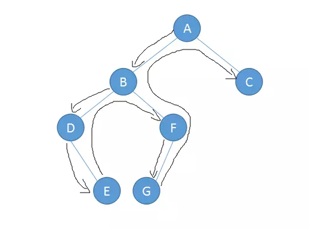
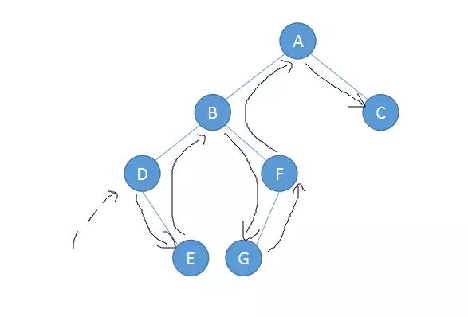
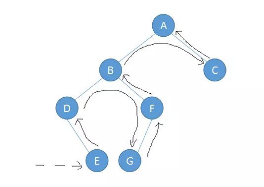

# 树

## 概念

在树结构中，每一个结点只有一个前件，称为父结点，没有前件的结点只有一个，称为树的根结点，简称树的根（root）。每一个结点可以有多个后件，称为该结点的子结点。没有后件的结点称为叶子结点。一个结点所拥有的子结点的个数称为该结点的度，所有结点中最大的度称为树的度。树的最大层次称为树的深度。

## 二叉树

二叉树是一种特殊的树，它的子节点个数不超过两个，且分别称为该结点的左子树（left subtree）与右子树（right subtree），二叉树常被用作二叉查找树和二叉堆或是二叉排序树（BST）。

## 遍历

按一定的规则和顺序走遍二叉树的所有结点，使每一个结点都被访问一次，而且只被访问一次，这个操作被称为树的遍历，是对树的一种最基本的运算。由于二叉树是非线性结构，因此，树的遍历实质上是将二叉树的各个结点转换成为一个线性序列来表示。
按照根节点访问的顺序不同，树的遍历分为以下三种：前序遍历，中序遍历，后序遍历

1. 前序遍历：根节点->左子树->右子树
   

2. 中序遍历：左子树->根节点->右子树
   

3. 后序遍历：左子树->右子树->根节点
   

## 二叉查找树（BST）

实际应用中，树的每个节点都会有一个与之相关的值对应，有时候会被称为键。因此，我们在构建二叉查找树的时候，确定子节点非常的重要，通常将相对较小的值保存在左节点中，较大的值保存在右节点中，这就使得查找的效率非常高，因此被广泛使用。

## 二叉查找树的实现

```js
class Node {
  constructor(key) {
    this.key = key
    this.left = null
    this.right = null
  }
  show() {
    return this.key
  }
}

class BST {
  constructor() {
    this.root = null //根节点
  }

  static insertNode(node, newNode) {
    if (node.key > newNode.key) {
      if (node.left === null) {
        node.left = newNode
      } else {
        this.insertNode(node.left, newNode)
      }
    } else {
      if (node.right === null) {
        node.right = newNode
      } else {
        this.insertNode(node.right, newNode)
      }
    }
  }

  insert(key) {
    const newNode = new Node(key)

    if (this.root === null) {
      this.root = newNode
    } else {
      this.insertNode(this.root, newNode)
    }
  }
}
```
