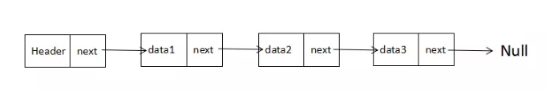

# 链表

在很多编程语言中，数组的长度都是固定的，如果数组已被数据填满，再要加入新的元素是非常困难的。而且，对于数组的删除和添加操作，通常需要将数组中的其他元素向前或者向后平移，这些操作也是十分繁琐的。

然而，JS 中数组却不存在上述问题，主要是因为他们被实现了成了对象，但是与其他语言相比（比如 C 或 Java），那么它的效率会低很多。

这时候，我们可以考虑使用链表(Linked-list) 来替代它，除了对数据的随机访问，链表几乎可以在任何可以使用一维数组的情况中。如果你正巧在使用 C 或者 Java 等高级语言，你会发现链表的表现要优于数组很多。

## 定义

在链表头部有一个 header 节点 成为*头结点* 表示链表的头部。在每个节点对象的 data 中保存数据 next 中保存下一个链表的引用。最后一个元素的 next 指向 null



## 题目

输入一个链表，按链表值从尾到头的顺序返回一个 ArrayList。

```js
function printListFromTailToHead(head) {
  // write code here
  let arr = []
  while (head) {
    arr.push(head.val)
    head = head.next
  }
  return arr.reverse()
}
```

## 实现

```js
class Node {
  constructor(data) {
    this.data = data //数据
    this.next = null //下一个节点的指针
  }
}

class NodeList {
  constructor(item) {
    this.head = new Node(item)
  }

  find(item) {  //查找
    let currNode = this.head
    while (currNode && currNode.data !== item) {
      if (currNode.next) {
        currNode = currNode.next
      } else {
        currnNode = null
      }
    }
    return currNode
  }

  findLastNode() {  //查找最后一个元素
    let currNode = this.head
    while(currNode.next) {
      currNode = currNode.next
    }
    return currNode
  }

  findPreNode(item) { //查找前一元素
    let currNode = this.head
    while (currNode && currNode.next && currNode.next.data !== item) {
      if (currNode.next) {
      currNode = currNode.next;
    } else {
      currNode = null;

    }
    return currNode
  }

  insert(newItem, beforeItem) { //插入
    let newNode = new Node(newItem)
    if(beforeItem) {
      let currNode = this.find(beforeItem)
      newNode.next = currNode.next
      currNode.next = newNode
    }else {
      let lastNode = this.findLastNode()
      lastNode.next = newNode
    }
  }

  remove(item) {  //删除
    let preNode = this.findPreNode(item)
    if(preNode.next) {
      preNode.next = preNode.next.next
    }
  }
}
```
