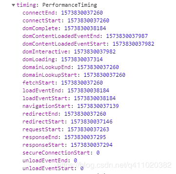
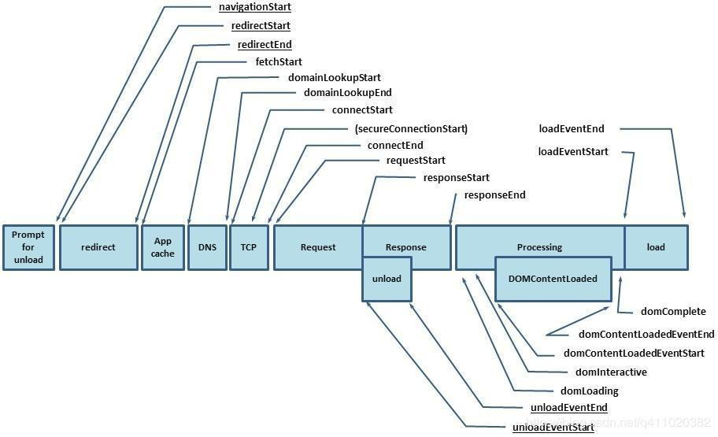
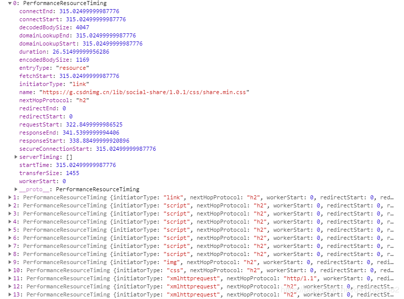

# 性能监控

性能监控一般利用window.performance进行数据采集

Performance 接口可以获取到当前页面中与性能相关的信息，它是 High Resolution Time API 的一部分，同时也融合了 Performance Timeline API、Navigation Timing API、 User Timing API 和 Resource Timing API。

这个api的属性timing包含了页面加载各个阶段的起始及结束的时间




```js
timing: {
  // 同一个浏览器上一个页面卸载(unload)结束时的时间戳。如果没有上一个页面，这个值会和fetchStart相同。
 navigationStart: 1543806782096,

 // 上一个页面unload事件抛出时的时间戳。如果没有上一个页面，这个值会返回0。
 unloadEventStart: 1543806782523,

 // 和 unloadEventStart 相对应，unload事件处理完成时的时间戳。如果没有上一个页面,这个值会返回0。
 unloadEventEnd: 1543806782523,

 // 第一个HTTP重定向开始时的时间戳。如果没有重定向，或者重定向中的一个不同源，这个值会返回0。
 redirectStart: 0,

 // 最后一个HTTP重定向完成时（也就是说是HTTP响应的最后一个比特直接被收到的时间）的时间戳。
 // 如果没有重定向，或者重定向中的一个不同源，这个值会返回0.
 redirectEnd: 0,

 // 浏览器准备好使用HTTP请求来获取(fetch)文档的时间戳。这个时间点会在检查任何应用缓存之前。
 fetchStart: 1543806782096,

 // DNS 域名查询开始的UNIX时间戳。
        //如果使用了持续连接(persistent connection)，或者这个信息存储到了缓存或者本地资源上，这个值将和fetchStart一致。
 domainLookupStart: 1543806782096,

 // DNS 域名查询完成的时间.
 //如果使用了本地缓存（即无 DNS 查询）或持久连接，则与 fetchStart 值相等
 domainLookupEnd: 1543806782096,

 // HTTP（TCP） 域名查询结束的时间戳。
        //如果使用了持续连接(persistent connection)，或者这个信息存储到了缓存或者本地资源上，这个值将和 fetchStart一致。
 connectStart: 1543806782099,

 // HTTP（TCP） 返回浏览器与服务器之间的连接建立时的时间戳。
        // 如果建立的是持久连接，则返回值等同于fetchStart属性的值。连接建立指的是所有握手和认证过程全部结束。
 connectEnd: 1543806782227,

 // HTTPS 返回浏览器与服务器开始安全链接的握手时的时间戳。如果当前网页不要求安全连接，则返回0。
 secureConnectionStart: 1543806782162,

 // 返回浏览器向服务器发出HTTP请求时（或开始读取本地缓存时）的时间戳。
 requestStart: 1543806782241,

 // 返回浏览器从服务器收到（或从本地缓存读取）第一个字节时的时间戳。
        //如果传输层在开始请求之后失败并且连接被重开，该属性将会被数制成新的请求的相对应的发起时间。
 responseStart: 1543806782516,

 // 返回浏览器从服务器收到（或从本地缓存读取，或从本地资源读取）最后一个字节时
        //（如果在此之前HTTP连接已经关闭，则返回关闭时）的时间戳。
 responseEnd: 1543806782537,

 // 当前网页DOM结构开始解析时（即Document.readyState属性变为“loading”、相应的 readystatechange事件触发时）的时间戳。
 domLoading: 1543806782573,

 // 当前网页DOM结构结束解析、开始加载内嵌资源时（即Document.readyState属性变为“interactive”、相应的readystatechange事件触发时）的时间戳。
 domInteractive: 1543806783203,

 // 当解析器发送DOMContentLoaded 事件，即所有需要被执行的脚本已经被解析时的时间戳。
 domContentLoadedEventStart: 1543806783203,

 // 当所有需要立即执行的脚本已经被执行（不论执行顺序）时的时间戳。
 domContentLoadedEventEnd: 1543806783216,

 // 当前文档解析完成，即Document.readyState 变为 'complete'且相对应的readystatechange 被触发时的时间戳
 domComplete: 1543806783796,

 // load事件被发送时的时间戳。如果这个事件还未被发送，它的值将会是0。
 loadEventStart: 1543806783796,

 // 当load事件结束，即加载事件完成时的时间戳。如果这个事件还未被发送，或者尚未完成，它的值将会是0.
 loadEventEnd: 1543806783802
}
```

通过以上数据，我们可以得到几个有用的时间

```js
// 重定向耗时
redirect: timing.redirectEnd - timing.redirectStart,
// DOM 渲染耗时
dom: timing.domComplete - timing.domLoading,
// 页面加载耗时
load: timing.loadEventEnd - timing.navigationStart,
// 页面卸载耗时
unload: timing.unloadEventEnd - timing.unloadEventStart,
// 请求耗时
request: timing.responseEnd - timing.requestStart,
// 获取性能信息时当前时间
time: new Date().getTime(),
```

还有一个比较重要的时间就是白屏时间，它指从输入网址，到页面开始显示内容的时间。

将以下脚本放在 `</head>` 前面就能获取白屏时间。

```html
<script>
    whiteScreen = new Date() - performance.timing.navigationStart
</script>
```

## 资源监控

另外，通过 window.performance.getEntriesByType('resource') 这个方法，我们还可以获取相关资源（js、css、img...）的加载时间，它会返回页面当前所加载的所有资源。



它一般包括以下几个类型

sciprt
link
img
css
fetch
other
xmlhttprequest
我们只需用到以下几个信息

```js
// 资源的名称
name: item.name,
// 资源加载耗时
duration: item.duration.toFixed(2),
// 资源大小
size: item.transferSize,
// 资源所用协议
protocol: item.nextHopProtocol,

```

## DEMO

```js
// 收集性能信息
const getPerformance = () => {
    if (!window.performance) return
    const timing = window.performance.timing
    const performance = {
        // 重定向耗时
        redirect: timing.redirectEnd - timing.redirectStart,
        // 白屏时间
        whiteScreen: whiteScreen,
        // DOM 渲染耗时
        dom: timing.domComplete - timing.domLoading,
        // 页面加载耗时
        load: timing.loadEventEnd - timing.navigationStart,
        // 页面卸载耗时
        unload: timing.unloadEventEnd - timing.unloadEventStart,
        // 请求耗时
        request: timing.responseEnd - timing.requestStart,
        // 获取性能信息时当前时间
        time: new Date().getTime(),
    }

    return performance
}

// 获取资源信息
const getResources = () => {
    if (!window.performance) return
    const data = window.performance.getEntriesByType('resource')
    const resource = {
        xmlhttprequest: [],
        css: [],
        other: [],
        script: [],
        img: [],
        link: [],
        fetch: [],
        // 获取资源信息时当前时间
        time: new Date().getTime(),
    }

    data.forEach(item => {
        const arry = resource[item.initiatorType]
        arry && arry.push({
            // 资源的名称
            name: item.name,
            // 资源加载耗时
            duration: item.duration.toFixed(2),
            // 资源大小
            size: item.transferSize,
            // 资源所用协议
            protocol: item.nextHopProtocol,
        })
    })

    return resource
}
```

<https://juejin.im/post/6892003555818143752#heading-32>
