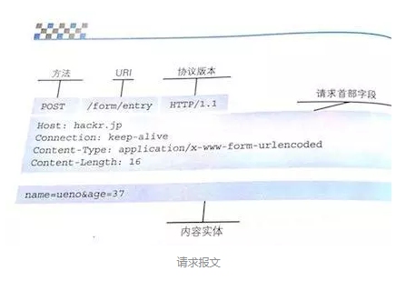
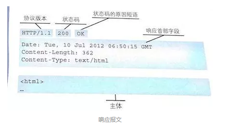

# HTTP协议

HTTP是无状态协议，因此双方不知晓对方当前的身份和状态。 由此诞生了Cookie技术：客户端的状态管理。

浏览器会根据服务端返回的响应首部字段信息Set-Cookie通知自动保持Cookie。每次客户端发送HTTP请求也会携带Cookie作为服务端识别客户端身份状态的标识

## 请求报文和响应报文
客户端发起请求时会生成请求报文

请求报文由方法（POST/GET）、URL、协议版本（HTTP/1.1、2等）、可选的请求首部字段和内容实体构成

服务器返回的响应报文由协议版本、状态码、用以解释状态的原因短语、可选的响应首部字段以及实体主体构成

# 常见状态码
### 2XX 成功
* 200 OK，表示从客户端发来的请求在服务器端被正确的处理
* 204 No content,表示请求成功，但响应报文不含实体的主体部分（没有返回任何内容）
* 206 Partial Content，进行范围请求

### 3XX重定向（网址跳转）
* 301 moved permanently，永久性重定向
* 302 found，临时性重定向，表示自愿临时被分配了新的URL（24-48小时）
* 303 see other，表示资源存在另一个URL，应使用GET获取（对于301/302/303响应，几乎所有浏览器都会删除报文主体并自动用GET重新请求）
* 304 not modified，表示服务器允许访问资源，但请求未满足条件的情况
* 307 temporary redirect，临时重定向，跟302相同，但是期望客户端保持请求方法不变向新的地址发出请求
* 308 跟301相似 区别在于希望客户端保持请求方法不变（类似302-307）

### 4XX客户端错误
* 400 bad request，请求报文存在语法错误
* 401 unauthorized，要求身份验证，对于需要登录的网页，服务器可能返回此响应
* 403 forbidden，请求资源的访问被服务器拒绝
* 404 not found，表示在服务器上没有找到请求的资源

### 5XX服务器错误
* 500 internal sever error，表示服务器端在执行请求时发生了错误
* 501 not implemented，表示服务器不支持当前请求所需要的某个功能
* 503 service unavailable，表明服务器暂时处于超负载或正在停机维护，无法处理请求

# HTTP首部
## 通用首部
指请求报文和响应报文都可以使用的字段

* Cache-Control
  * no-cache 指客户端不缓存过期资源
  * no-store 指不进行缓存
  * max-age 指缓存资源的缓存时间比指定的值小，那么客户端就接受缓存资源，且缓存服务器不对资源有效性进行再次确认

* Connection 指控制不再转发给代理的首部字段（Hop-by-hop），管理持久连接
  * close 指服务器想明确断开连接
  * Keep-Alive 指保存持久连接，HTTP/1.1前默认连接是非持久性的，如需要保存持久连接，需要增加此字段

* upgrade 可以用来指定一个完全不同的通信协议，对于这个字段，服务器可以返回101状态码

# 请求方法
* GET：get方法一般用于获取服务器资源
* POST：post方法一般用于传输实体主体
* PUT：put方法一般用于传输文件
* DELETE：delete方法用于删除文件
* HEAD：head方法用于获取报文首部，不返回报文主体
* OPTIONS：options方法用于询问请求URI资源支持的方法