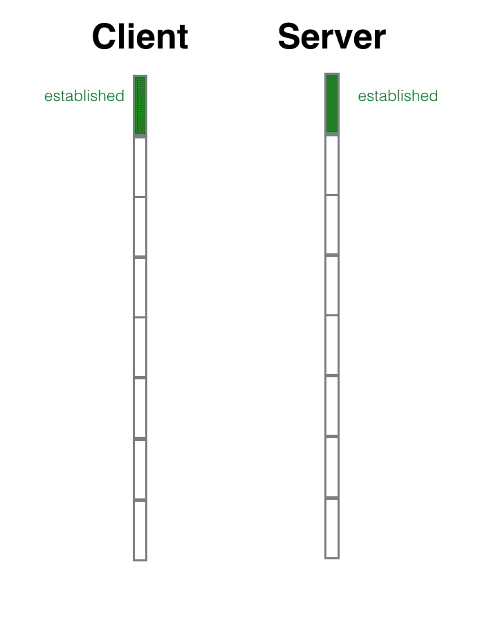

# TCP
## 三次握手
* 第一次：服务端可以确认，自己可以接受客户端发送的报文
* 第二次：客户端可以确认，服务端收到了自己发送的报文
* 第三次：服务端可以确认，客户端收到了自己发送的报文

张三招手--李四点头微笑--李四招手--张三点头微笑

其中李四连续进行了2个动作，先是点头微笑(回复对方)，然后再次招手(寻求确认)

张三招手--李四点头微笑并招手--张三点头微笑

## 四次挥手

TCP断开链接的过程和建立链接的过程比较类似，只不过中间的两部并不总是会合成一步走，所以它分成了4个动作，张三挥手(fin)——李四伤感地微笑(ack)——李四挥手(fin)——张三伤感地微笑(ack)。

之所以中间的两个动作没有合并，是因为tcp存在「半关闭」状态，也就是单向关闭。张三已经挥了手，可是人还没有走，只是不再说话，但是耳朵还是可以继续听，李四呢继续喊话。等待李四累了，也不再说话了，朝张三挥了挥手，张三伤感地微笑了一下，才彻底结束了。

全双工状态导致TCP并不是一问一答 之所以没有合并是因为服务端响应客户端挥手后，可能还有数据没有传输完毕，所以并不会立即挥手

四次挥手也并不总是四次挥手，中间的两个动作有时候是可以合并一起进行的，这个时候就成了三次挥手，主动关闭方就会从fin_wait_1状态直接进入到time_wait状态，跳过了fin_wait_2状态。

### 2MSL time_wait

主动关闭的一方会承担一个长达2MSL（maximium segment lifetime——最长报文寿命 2分钟）也就是4分钟的**time_wait**状态

它的作用是重传最后一个ack报文，确保对方可以收到。因为如果对方没有收到ack的话，会重传fin报文，处于time_wait状态的套接字会立即向对方重发ack报文。

同时在这段时间内，该链接在对话期间于网际路由上产生的残留报文(因为路径过于崎岖，数据报文走的时间太长，重传的报文都收到了，原始报文还在路上)传过来时，都会被立即丢弃掉。4分钟的时间足以使得这些残留报文彻底消逝。不然当新的端口被重复利用时，这些残留报文可能会干扰新的链接。

